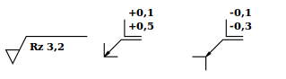
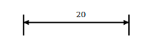
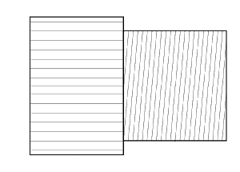

# Technical Drawings using SVG


Technical drawings can be created easy from the Webbrowser using SVG. We want to share some of our knowledge here with you. Content:
* technical advantages of SVG
* recommendation: use d3 for editing SVG
* SVG drawing elements. Creating symbols, dimensions, dotted lines, hatching

### Links
- [good SVG Tutorial by jenkov](http://tutorials.jenkov.com/svg/index.html); all important things included
- [Mozillas SVG-Element Reference](https://developer.mozilla.org/en-US/docs/Web/SVG/Element#Shape_elements)
- [SVG 1.1 Specification by W3C](https://www.w3.org/TR/SVG/expanded-toc.html)


## Why SVG


- SVG is scalable
- direct export to file possible
- SVG has a good performace good with fewer big objects and few colors (like in technical drawings)
- development speed:
  - integrated event handling
  - style classes
  - declare symbols and use them,
  - markers on line endings, dotted lines
  - patterns
- support:basic features are included almost in every browser; some advanced features not
  - [https://en.wikipedia.org/wiki/Comparison_of_layout_engines_%28Scalable_Vector_Graphics%29](https://en.wikipedia.org/wiki/Comparison_of_layout_engines_%28Scalable_Vector_Graphics%29)
  - [http://caniuse.com/#search=svg](http://caniuse.com/#search=svg)

- bad thing about SVG: no line breaks in SVG-TEXT available

### CANVAS vs SVG


- SVG your choice for technical drawings
- CANVAS gets slower, the more pixels are used (in a technical drawing you use big homogen faces - ideal for SVG)
- CANVAS might be exported to pdf, additional library necessary
- extra work for event handling (or use a framework, which will slow the performance of canvas down)
- CANVAS is good for pixel images with much details and is there much faster
- [Code Examples of Canvas and SVG](https://www.safaribooksonline.com/blog/2012/04/17/using-html5-canvas-vs-svg/)

  Very good comparision on [https://msdn.microsoft.com/library/gg193983%28v=vs.85%29.aspx](https://msdn.microsoft.com/library/gg193983%28v=vs.85%29.aspx)

  


## SVG framework [d3](https://d3js.org/)


- creating and appending attributes: short code (50% shorter than pure JS), clean, readable. (main reason for me)

```javascript
var g = d3.select("#svg").append("g");

    g.append('line') // LEFT LINE
        .attr({
            'x1': x1 ? x1 : 0,
            'y1': 25,
            'x2': x2,
            'y2': 25
    });
```

- building diagrams is fast through built in feature for scales, axes
- functions for zoom/scroll and drag&drop
- unified event handling for browser compatibility
- well documented, lots of examples
- fast
- binding JSON Data to SVG. For easy creating diagrams from JSON. Good feature for simple diagrams; we do not use it in the RAPIDFACTURE CAD - with major requirements to the data handling, "for loops" are more efficient and easy to use.


## Drawing Elements


### Symbols




```xml
<svg width="100mm" height="50mm" viewBox="0 0 420 297"
    stroke-width="0.1" font-size="3" fill="none"
    xmlns:dc="http://purl.org/dc/elements/1.1/"
    xmlns:svg="http://www.w3.org/2000/svg"
    xmlns="http://www.w3.org/2000/svg"
    xmlns:xlink="http://www.w3.org/1999/xlink" >


    <!-- define symbols, markers, hatching -->
    <defs>
        <path id="innerEdgeSymbol" d="m 0 -4 v 4 h 4 M 0 0 L 1.7 -1.2 M 0 0 L 1.2 -1.7 M 0 0 l 5 -5 h 6 m 0 -1 h -5 v -5" style="fill: none; stroke: black; stroke-width: 0.3;" />
        <path id="outerEdgeSymbol" d="m -4 0 h 4 v 4 M 0 0 L 1.5 -1 M 0 0 L 1 -1.5 M 0 0 l 5 -5 h 6 m 0 -1 h -5 v -5" style="fill: none; stroke: black; stroke-width: 0.3;" />
        <path id="surfaceSymbol" d="m 0 -2  h -4 l 2 4 l 4 -8 h 18" style="fill: none; stroke: black; stroke-width: 0.3;" />
    </defs>


    <!-- define style classes -->
    <style type="text/css">
        <![CDATA[

        text{
            fill: black;
        }

        .dataText {
            font-weight: bold;
        }

        ]]>
    </style>


    <!-- image content: use defined stuff from above  -->
    <g transform="translate(10, 17)">

        <g>
            <use xlink:href="#surfaceSymbol"></use> <!-- symbol  -->
            <text class="dataText" y="-2" x="3">Rz 3,2</text><!-- symbol  text-->
        </g>

        <g transform="translate(25,0)">
            <use xlink:href="#innerEdgeSymbol"></use>
            <text class="dataText" y="-12" x="7">+0,1</text>
            <text class="dataText" y="-8" x="7">+0,5</text>
        </g>

        <g transform="translate(55,0)">
            <use xlink:href="#outerEdgeSymbol"></use>
            <text class="dataText" y="-12" x="7">-0,1</text>
            <text class="dataText" y="-8" x="7">-0,3</text>
        </g>

    </g>


</svg>
```

### Dimensions




```xml
<svg
    width="420mm"
    height="297mm"
    viewBox="0 0 420 297"
    stroke-width="0.1"
    font-size="3"
    fill="none"
    xmlns:dc="http://purl.org/dc/elements/1.1/"
    xmlns:svg="http://www.w3.org/2000/svg"
    xmlns="http://www.w3.org/2000/svg"
    xmlns:xlink="http://www.w3.org/1999/xlink">

    <defs>
        <marker orient="auto" markerWidth="4" markerHeight="8" refY="2" refX="0" id="start">
            <path d="M0,2 L4,4 V0 Z" fill="black"></path>
        </marker>
        <marker orient="auto" markerWidth="4" markerHeight="8" refY="2" refX="4" id="end">
            <path d="M0,0 V4 L4,2 Z" fill="black"></path>
        </marker>
    </defs>

    <style type="text/css">
        <![CDATA[

        line {
            stroke: black;
            stroke-width: 0.5px;
        }

        .dimensionText {
            fill: black;
            marker-end: url(#endArrow);
            text-anchor: "middle";
        }

        ]]>
    </style>

    <line y2="17" x2="50" y1="25" x1="50"></line>
    <line y2="17" x2="10" y1="25" x1="10"></line>
    <line y2="20" x2="50" y1="20" x1="10" marker-end="url(#end)" marker-start="url(#start)"></line>
    <text class="dimensionText" x="30" y="18">20</text>

</svg>
```
### Dotted Lines


```xml
<svg width="200" height="200" viewPort="0 0 200 300" version="1.1" xmlns="http://www.w3.org/2000/svg">

    <line stroke-dasharray="5, 5"              x1="10" y1="10" x2="190" y2="10" />
    <line stroke-dasharray="5, 10"             x1="10" y1="30" x2="190" y2="30" />
    <line stroke-dasharray="10, 5"             x1="10" y1="50" x2="190" y2="50" />
    <line stroke-dasharray="5, 1"              x1="10" y1="70" x2="190" y2="70" />
    <line stroke-dasharray="1, 5"              x1="10" y1="90" x2="190" y2="90" />
    <line stroke-dasharray="0.9"               x1="10" y1="110" x2="190" y2="110" />
    <line stroke-dasharray="15, 10, 5"         x1="10" y1="130" x2="190" y2="130" />
    <line stroke-dasharray="15, 10, 5, 10"     x1="10" y1="150" x2="190" y2="150" />
    <line stroke-dasharray="15, 10, 5, 10, 15" x1="10" y1="170" x2="190" y2="170" />
    <line stroke-dasharray="5, 5, 1, 5"        x1="10" y1="190" x2="190" y2="190" />

<style><![CDATA[
line{
    stroke: black;
    stroke-width: 2;
}
]]></style>
</svg>
```
This code is from https://developer.mozilla.org/en-US/docs/Web/SVG/Attribute/stroke-dasharray


### Hatching



```xml
<defs>
    <pattern id="knurl" height="2" width="2" patternTransform="rotate(90)" patternUnits="userSpaceOnUse">
            <path d="m 0 0 v 10" stroke="grey"></path>
    </pattern>
</defs>

<path fill="url(#knurl)" d="M0,-15 L20,-15 L20,15 L0,15Z"></path>
```

* change the angle of the lines with attribute "patternTransform"
* change the line distance with attribute "width"
