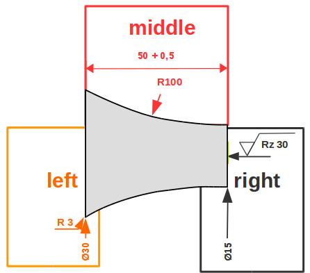

# Docu of JSON format for turned parts


Turned parts are stored by an array of contour elements which hold further details (dimensions, features, etc.).


For alive Example in Code [see here](example.json):

The basic document structure consists of three parts:

```javascript
{
    "meta": {}, // some meta info about drawing in this obj
    "innerContour": [], // array of contour elements
    "outerContour": [], // array of contour elements
}
```

## Meta Information


The following meta information is used for the drawing:


```javascript
{
  "companyName": "RAPIDFACTURE",
  "marking": "Test Part",
  "drawingNumber": "1",
  "draftsman": "",
  "checker": "",
  "date": "",
  "scale": "auto",
  "paperSize": "A4",
  "units": "mm",
  "generalTolerance": "DIN 2768 - mittel",
  "material": "C45",
  "surface": "Ra 6,3",
  "innerEdge": "+0,3 bis +0,5",
  "outerEdge": "-0,1 bis -0,3"
}
```

Ideas: could also consist "size" (diameter/length), "weight".

## Contour


Inner and outer contour use the same structure for describing the contour.

### Example contour element

Every Contour Element has the baisc structure:

```javascript
{
    "meta":{},  // meta info for every contour element
    "left":{},
    "middle":{},
    "right":{}
}
```



"left", "middle" and "right" each hold information for one main dimension and can hold optional information about edges, faces and features.

There are three element types to represent the contour: cylinder, cone or circle. (Maybe we add another one with splines in the future)


```javascript
[{
    "type": "cylinder",         // elementtype: cylinder, cone or circle

    "meta": {
        "dimension-type": 0     // cone and circle elements can have different definitions of their dimensions
    },
    "left": {
        "dimension": {          // left diameter
            "value": 50,        // value in mm
            "tolerance": {      // optional tolerance object
                "value": 0.1    // value in mm
                "type": "+"     // tolerance type; +, -, ±, +-; letters like "H, G, h, g" for fittings
            }

        }
    },
    "middle": {
        "dimension": {          // element length
            "value": 20,        // value in mm
            "link-to-element": 0// the end of the element can also be referenced to another element; element length stays the same
        },
        "face": {               // surface definition
            "surface-roughness": 30
        }
    },
    "right": {
        "dimension": {          // right diameter dimension
            "value": 50,        // value in mm
        },
        "edge": {               // edge definition
            "value": 2,         // size in mm
            "type": "radius"
        },
        "feature": {            // features
            "groove": {},
            "booring": {}
        }
    },
},
{} // next element ...
]
```
